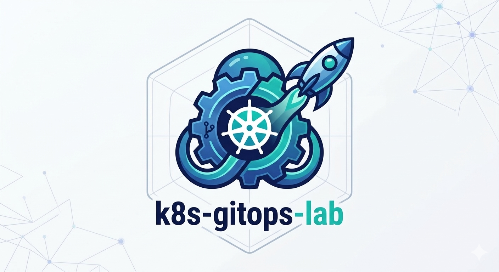
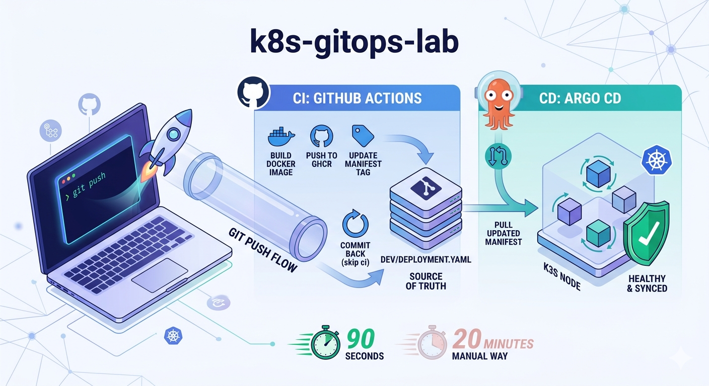
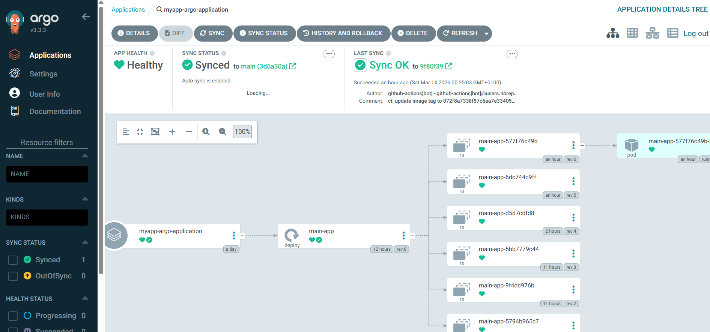

<div align="center">
  
</div>

> A hands-on project to answer one question: *"How do I push code and see it running in Kubernetes without doing anything manually?"*


---

## The Problem

I am running experiments that involve stressing a k3s node under different load conditions and observing how the cluster behaves — CPU contention between pods, resource throttling, metric degradation under pressure. The kind of work where you constantly adjust what you measure and how you measure it.

Every time I needed to test a change to the application the process looked like this:

1. Tune the application logic or metric collection
2. Build the Docker image locally
3. Push it to the local registry
4. Run `kubectl apply` with the new image
5. Wait for the pod to restart
6. Check the logs to see if it worked

Every single iteration was taking around **20 minutes**. Most of that time wasn't thinking — it was waiting and repeating the same commands. When you are iterating quickly on what to observe and how, that overhead adds up fast.

After going through this enough times the question became obvious: why am I doing this manually?

---

## The Idea

The solution is to automate the entire path from code to cluster. Every time you push, the system takes care of the rest. What used to take 20 minutes now takes a `git push` and 90 seconds of waiting.

---

## The Two Tools

This project uses two tools that each own one half of the problem.

**GitHub Actions** owns the CI part. It watches the repository and every time code changes it builds a new Docker image, pushes it to the registry, and updates the deployment manifest with the new image tag. It then commits that change back to the repository. GitHub Actions never touches the cluster directly.

**ArgoCD** owns the CD part. It runs inside the cluster and watches the repository. When it detects a new commit in the `dev/` folder it pulls the updated manifest and applies it to the cluster with a rolling update. ArgoCD never builds images.

They communicate through the repository. One writes, the other reads.

---

## The Flow



```
git push
    │
    ▼
GitHub Actions
    │  builds Docker image (linux/amd64 + linux/arm64)
    │  pushes image to GHCR
    │  updates image tag in dev/deployment.yaml
    │  commits back to repo  [skip ci]
    │
    ▼
ArgoCD detects new commit
    │  pulls updated manifest
    │  applies rolling update to cluster
    │
    ▼
New pod running ✅
```

---

## CI — GitHub Actions

The pipeline triggers only when `app/` or `Dockerfile` changes. This avoids unnecessary builds when editing documentation or Kubernetes manifests.

Each run takes about 90 seconds and produces a multi-platform image that works on both AMD64 and ARM devices. The commit back to the repo uses the `[skip ci]` tag to prevent the pipeline from triggering itself in a loop.

The only secret needed is a Personal Access Token (`GH_PAT`) with `repo` scope so the pipeline can write back to the repository.

---

## CD — ArgoCD

ArgoCD runs as a set of pods inside the cluster. The `application.yaml` file tells it which repository and which folder to watch. Once connected, it reconciles the cluster state against the repository on every detected change.



The cluster is **Healthy** and **Synced** to the latest commit. The deployment history on the right shows every revision ArgoCD has applied — each one triggered automatically by a commit from the CI pipeline. Any of these revisions can be used to roll back with a single click.

One detail worth noting: the author on every sync is `github-actions[bot]`. ArgoCD is applying commits it did not create — it simply reacts to whatever lands in the repository.

---

## Key Concepts

**Separation of concerns.** CI builds and publishes artifacts. CD deploys them. Neither tool needs credentials to the other's domain.

**The repository as the source of truth.** What is in `dev/deployment.yaml` is what runs in the cluster. If someone changes something in the cluster manually, ArgoCD reverts it to match the repository.

**Zero-touch deployments.** From the moment of `git push` to a running updated pod, no human intervention is required.

---

## Structure

```
k8s-gitops-lab/
├── .github/workflows/
│   └── ci.yml           ← GitHub Actions pipeline
├── app/
│   ├── main.py          ← Application code
│   └── requirements.txt
├── dev/
│   └── deployment.yaml  ← ArgoCD watches this folder
├── application.yaml     ← Tells ArgoCD what repo/path to sync
└── Dockerfile
```

---

## Built With

| Tool | Role |
|---|---|
| GitHub Actions | CI — build image, update manifest |
| ArgoCD | CD — sync cluster to repo state |
| GHCR | Container registry |
| k3s | Kubernetes distribution |
| Docker | Container runtime |

---

## References

- **[ArgoCD Tutorial for Beginners | GitOps CD for Kubernetes](https://www.youtube.com/watch?v=MeU5_k9ssrs)** — TechWorld with Nana. Clear explanation of the GitOps philosophy and how ArgoCD implements it. Helped understand why the repository should be the source of truth rather than running `kubectl` commands directly.

- **[GitHub Actions Tutorial - Basic Concepts and CI/CD Pipeline with Docker](https://www.youtube.com/watch?v=R8_veQiYBjI)** — TechWorld with Nana. Covered the fundamentals of workflows, jobs, and steps, and how to connect a Docker build pipeline to a registry. The foundation for the `ci.yml` in this project.
